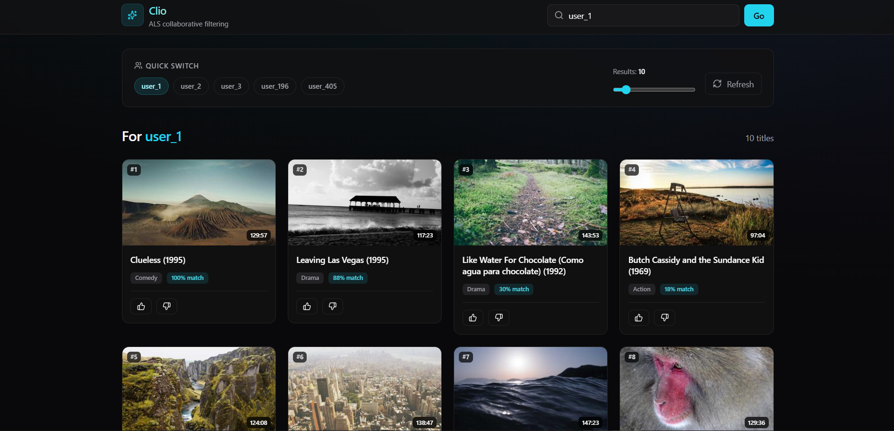
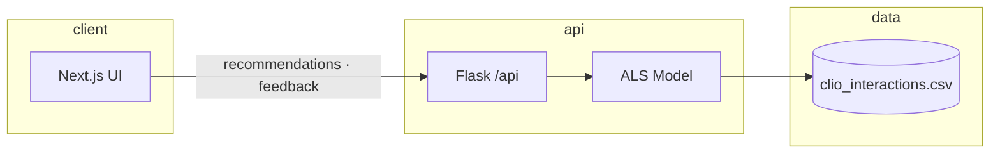

<h1 align="center">Clio</h1>
<p align="center">Collaborative filtering recommendations on MovieLens 100K</p>

<p align="center">
  <a href="https://abzyvantae-clio-recommeder.hf.space"></a>
  <a href="https://github.com/abeeraisabeera/Clio-Video-Recommendation-System"></a>
</p>

<p align="center">
  
  
  
  
  
  
  
  
  
</p>

<p align="center">
  
</p>

<p align="center">
  Search by user ID · ranked movie cards · thumbs-up/down feedback · match scores
</p>

---

## Overview

Clio trains an **Alternating Least Squares** model on 100K real user–movie ratings, serves personalized lists through a Flask API, and ships a Next.js UI where feedback reranks results instantly—without a full retrain.

---

## Architecture



**Local:** Next.js `:3000` → Flask `:5000`  
**Production:** [Vercel](https://vercel.com) frontend → [HF Space](https://huggingface.co/spaces/abzyvantae/clio_recommeder) API (or all-in-one on HF Docker)

---

## Tech stack

**Machine learning** — Python, `implicit` ALS, scikit-learn, SciPy sparse matrices, pandas  
**Backend** — Flask, gunicorn, CORS  
**Frontend** — Next.js 16, React 19, Tailwind CSS 4, Axios, Lucide icons  
**Tooling** — pnpm monorepo, pytest, Vitest, Docker  
**Dataset** — [MovieLens 100K](https://grouplens.org/datasets/movielens/100k/)

---

## Model

- **Algorithm:** ALS collaborative filtering (`recalculate_user=True` at inference)
- **Matrix:** 943 users × 1,682 items (CSR)
- **Hyperparameters:** 100 factors · 0.05 regularization · 50 iterations
- **Signal:** `1 + 2.5 × max(rating − 2.5, 0)` per interaction
- **Feedback:** +0.3 boost on 👍 · hide on 👎 (in-memory rerank)

---

## Offline evaluation

80/20 per-user hold-out · 100 sampled users · `python evaluate.py`

```
Precision@5   0.328    Recall@5    0.121    NDCG@5    0.313
Precision@10  0.272    Recall@10   0.192    NDCG@10   0.301
Precision@20  0.208    Recall@20   0.278    NDCG@20   0.308
```

Run your own: `pnpm evaluate` or `python evaluate.py --users 500 --k 10`

---

## Quick start

```bash
git clone https://github.com/abeeraisabeera/Clio-Video-Recommendation-System.git
cd Clio-Video-Recommendation-System

python prepare_data.py
pip install -r requirements-docker.txt
corepack enable && pnpm install

pnpm dev          # Flask :5000 + Next.js :3000
pnpm test         # pytest + vitest
```

`clio-frontend/.env.local` → `NEXT_PUBLIC_API_URL=http://localhost:5000` (or your HF Space URL on Vercel)

---

## API

```http
GET  /api/health
GET  /api/recommendations/user_196?n=10
POST /api/feedback
GET  /api/movies?limit=100
```

```bash
curl "https://abzyvantae-clio-recommeder.hf.space/api/recommendations/user_196?n=5"
```

---

## Deploy

**Hugging Face** — Docker Space [abzyvantae/clio_recommeder](https://huggingface.co/spaces/abzyvantae/clio_recommeder) · port `7860` · UI + API same origin

**Vercel** — Root directory `clio-frontend` · env `NEXT_PUBLIC_API_URL=https://abzyvantae-clio-recommeder.hf.space`

```bash
pnpm build:hf && cp -r clio-frontend/out static   # before HF Docker push
```

---

## Project structure

```
app.py · model.py · prepare_data.py · evaluate.py
clio-frontend/     Next.js app
tests/             pytest suite
Dockerfile         Hugging Face Spaces
```

---

<p align="center">
  <sub>MovieLens 100K · Harper & Konstan, 2015 · MIT License</sub>
</p>
