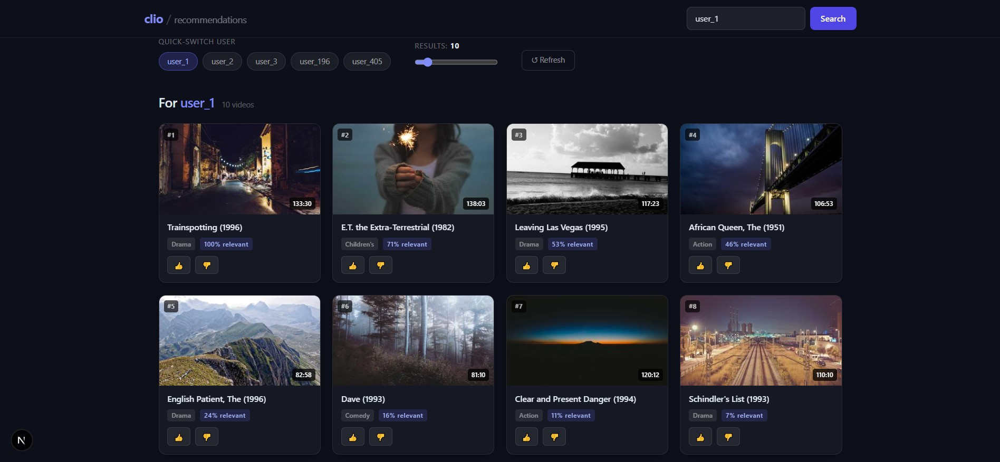

# Clio — Video Recommendation Engine

A full-stack recommendation system using **Alternating Least Squares (ALS)** collaborative filtering on the MovieLens 100K dataset. Built to demonstrate end-to-end ML system design: data pipeline → model training → REST API → interactive frontend with real-time feedback.

---

## Architecture

```
┌─────────────────────────────────────────────────────────┐
│                      Browser                            │
│              Next.js  (localhost:3000)                  │
│         Search · Cards · Thumbs up/down UI              │
└──────────────────────┬──────────────────────────────────┘
                       │ HTTP
┌──────────────────────▼──────────────────────────────────┐
│              Node.js Proxy  (localhost:3001)             │
│        Validation · Rate limiting · Error shaping        │
└──────────────────────┬──────────────────────────────────┘
                       │ HTTP
┌──────────────────────▼──────────────────────────────────┐
│            Flask ML Server  (localhost:5000)             │
│  ALS Model · /recommend · /feedback · /health · /movies │
└──────────────────────┬──────────────────────────────────┘
                       │
              clio_interactions.csv
              (MovieLens 100K, 100,000 ratings)
```

---

## Features

- **Collaborative filtering** via ALS (`implicit` library) on 100K real user–item interactions
- **Rich recommendations** — each result includes title, category, match score, thumbnail, duration
- **Feedback loop** — thumbs up/down adjusts scores in real time without retraining
- **Offline evaluation** — Precision@k, Recall@k, NDCG@k with train/test split
- **Production patterns** — health endpoint, rate limiting, structured errors, request logging
- **Skeleton loaders**, staggered animations, responsive card grid

---

## Quickstart

### 1. Prepare data

```bash
python prepare_data.py
```

Downloads MovieLens 100K (~5 MB) and outputs:
- `clio_interactions.csv` — 100,000 user–movie interactions with weights
- `movies.csv` — metadata for 1,682 movies

### 2. Python backend

```bash
python -m venv venv && source venv/bin/activate
pip install flask flask-cors implicit scikit-learn scipy pandas numpy
python app.py
# → http://localhost:5000
```

### 3. Node proxy

```bash
npm install express axios cors
node index.js
# → http://localhost:3001
```

### 4. Frontend

```bash
npx create-next-app@latest clio-frontend && cd clio-frontend
# Copy page.js → src/app/page.js
npm run dev
# → http://localhost:3000
```

---

## API Reference

| Method | Endpoint | Description |
|--------|----------|-------------|
| `GET`  | `/api/health` | Liveness probe — model stats |
| `GET`  | `/api/recommendations/:userId?n=10` | Ranked recommendations with metadata |
| `POST` | `/api/feedback` | Record thumbs up / down |
| `GET`  | `/api/movies?limit=100` | Browse full catalogue |

### Example — get recommendations

```bash
curl "http://localhost:3001/api/recommendations/user_196?n=5"
```

```json
{
  "user_id": "user_196",
  "recommendations": [
    {
      "video_id": "movie_50",
      "score": 0.9821,
      "title": "Star Wars (1977)",
      "category": "Action",
      "thumbnail_url": "https://picsum.photos/seed/movie_50/320/180",
      "duration_seconds": 7680
    }
  ]
}
```

### Example — send feedback

```bash
curl -X POST http://localhost:3001/api/feedback \
  -H "Content-Type: application/json" \
  -d '{"user_id": "user_196", "video_id": "movie_50", "signal": "up"}'
```

---

## Evaluation

Run offline metrics against a held-out test split:

```bash
python evaluate.py
```

```
====================================================
  Clio ALS Recommender — Evaluation Report
  Dataset : clio_interactions.csv
  Split   : 80/20 train/test
  Users   : 300 sampled
====================================================
     k   Precision@k    Recall@k    NDCG@k
  ----------------------------------------
     5        0.2913      0.1097    0.2833
    10        0.2483      0.1807    0.2771
    20        0.1985      0.2730    0.2930
====================================================
```

Options:

```bash
python evaluate.py --k 20 --users 500 --split 0.2
```

---

## Model Details

| Parameter | Value |
|-----------|-------|
| Algorithm | ALS (Alternating Least Squares) |
| Library | `implicit` (GPU-optional) |
| Latent factors | 100 |
| Regularization | 0.05 |
| Iterations | 50 |
| Feedback weighting | rating / 5.0 → implicit confidence |

The interaction matrix is sparse (`scipy.csr_matrix`, 943 users × 1,682 items). ALS decomposes it into user and item factor matrices, enabling O(1) inference per recommendation request.

---

## Demo 

---
## Project Structure

```
clio Recommender/
├── prepare_data.py      # Downloads MovieLens, generates CSVs
├── app.py               # Flask ML server
├── evaluate.py          # Offline metrics (Precision, Recall, NDCG)
├── index.js             # Node.js proxy (validation, rate limiting)
├── clio-frontend/
│   └── src/app/
│       └── page.js      # Next.js UI
├── clio_interactions.csv  # Generated by prepare_data.py
└── movies.csv             # Generated by prepare_data.py
```

---

## Production Roadmap

- [ ] Persist feedback to PostgreSQL and schedule nightly retrains
- [ ] Replace in-memory rate limiter with Redis + `express-rate-limit`
- [ ] Add item-based fallback for cold-start users
- [ ] Containerise with Docker Compose
- [ ] Deploy Flask to Render, Next.js to Vercel (both free tier)

---

## Dataset

[MovieLens 100K](https://grouplens.org/datasets/movielens/100k/) — F. Maxwell Harper and Joseph A. Konstan. 2015. The MovieLens Datasets: History and Context. ACM TIIS 5(4).
